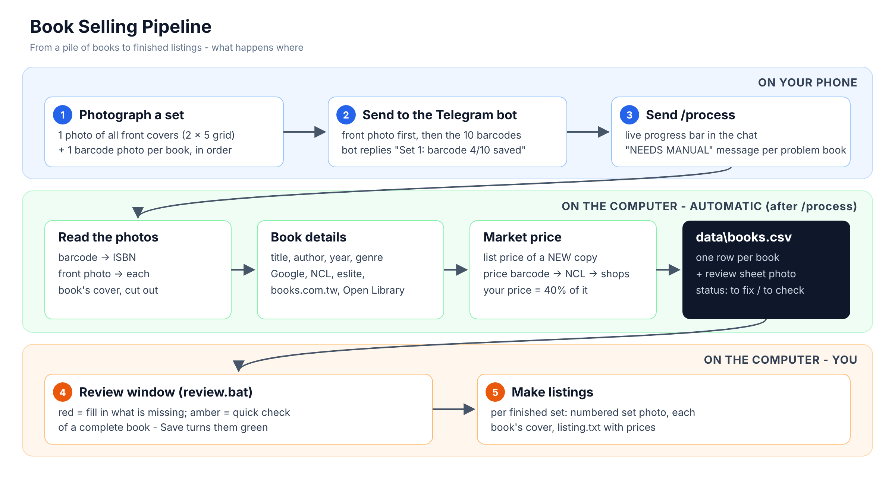

# Book Selling Pipeline

Photograph a set of books, send the photos to a Telegram bot, and get every book's ISBN, title, author and the price of
a new copy - with your selling price worked out for you. You fix anything missing in a simple review window, then make
one ready-to-post listing per set.



**Setting up for the first time?** Follow sections 1 → 2 → 3 in order (about 30 minutes, once).
After that, section 4 is all you need day to day.

1. [Install](#1-install)
2. [Set up the Telegram bot](#2-set-up-the-telegram-bot)
3. [Before your first set](#3-before-your-first-set)
4. [Daily use](#4-daily-use)
5. [How books and prices are found](#5-how-books-and-prices-are-found)
6. [What is stored, and statuses](#6-what-is-stored-and-statuses)
7. [Commands](#7-commands)
8. [Troubleshooting](#8-troubleshooting)
9. [Project layout](#9-project-layout)

---

## 1. Install

Written for Windows (PowerShell). On macOS / Linux the differences are noted in brackets.

### 1.1 You need

- **Python 3.11 or 3.12** from [python.org](https://www.python.org/downloads/). In the installer, tick
  **"Add python.exe to PATH"**. Check in a new PowerShell window: `python --version`
- **Telegram** on your phone (and a Telegram account).

### 1.2 Install the pipeline

Open PowerShell in the `Book Selling Pipeline` folder (in File Explorer: open the folder, then
**File → Open Windows PowerShell**, or type `powershell` in the address bar) and run, one line at a time:

```powershell
python -m venv .venv
.\.venv\Scripts\activate
python -m pip install --upgrade pip
python -m pip install -r requirements.txt
```

This makes a private Python environment (`.venv`) inside the folder and installs everything into it.
[macOS / Linux: use `.venv/bin/python` instead of `.\.venv\Scripts\python.exe`.]

> Typing `.\.venv\Scripts\python.exe` every time is optional: run `.\.venv\Scripts\Activate.ps1` once per window and
> plain `python` then means the project's Python. If PowerShell says "running scripts is disabled", run
> `Set-ExecutionPolicy -Scope CurrentUser RemoteSigned` once and try again. The rest of this README writes `python`.

### 1.3 Create your settings file

```powershell
Copy-Item .env.example .env
```
[macOS / Linux: `cp .env.example .env`]

`.env` holds your settings and keys. You fill in the Telegram part in section 2; everything else already has working
values. Each setting is explained in `.env` itself.

### 1.4 Check that it works

```powershell
python -m pip install -r requirements-dev.txt
python -m pytest
```
All tests should pass (they use made-up photos and no internet). Then try a real look-up:
```powershell
python -m pipeline lookup 9789861371955
```
It prints what each book source found for that ISBN (被討厭的勇氣).

---

## 2. Set up the Telegram bot

Follow **[TELEGRAM_SETUP.md](TELEGRAM_SETUP.md)** - it takes about 5 minutes: you create your own bot, put its token
and your user id into `.env`, and send it a first photo. It ends by sending you back here.

---

## 3. Before your first set

### 3.1 Recommended free keys (put them in `.env`)

| Key | What it adds | How to get it |
|---|---|---|
| `GOOGLE_BOOKS_API_KEY` | Google Books as a book source (1,000 look-ups a day) | [Google Cloud Console](https://console.cloud.google.com/): create a project → **APIs & Services → Library** → enable **Books API** → **Credentials → Create credentials → API key**. Then edit the key and under **API restrictions** choose Books API. |
| `TAVILY_API_KEY` | web search for books the shops' own search can't find (often out of print) | sign up at [tavily.com](https://tavily.com) - 1,000 searches a month, no credit card |
| `LANGSEARCH_API_KEY` | a second web search, used when Tavily is used up | sign up at [langsearch.com](https://langsearch.com) - free daily allowance |

Everything works without them; you just find fewer books and prices automatically. Keep keys only in `.env` - never
paste them anywhere else.

### 3.2 Lay out and photograph your first set

1. Lay the books in a grid: by default **2 rows of 5** (`GRID=2x5`, `SET_SIZE=10`). Book 1 is top-left, then left to
   right along the row, then the next row. Leave a small gap between books if you can, on a plain surface that
   contrasts with the covers - each book's cover picture is cut out of this photo automatically.
2. **Photo 1:** all the front covers together, in landscape, straight from above. Send it **as a File** (in Telegram:
   paperclip → File) for sharp cover pictures - a normal Telegram photo is shrunk to about 1280 px.
3. **Photos 2-11:** the back cover of each book with its barcode, in book order 1 → 10. Fill the frame, keep the
   barcode sharp and without glare. A normal photo is plenty.

Send them as described in section 4, then look at the **review sheet** the bot sends back: on each row, the book's
cover (cut out of the front photo) and its barcode photo must be the same book.

**How the covers are cut out.** The pipeline finds each book on the front photo (where it differs from the table, and
the straight edges between books), straightens slightly turned books, and saves each one at full resolution with a
small margin of table around it (`SEGMENT_MARGIN`, default 4% of the book's size). The shadow a book casts on the
table (darker table, same colour, carpet texture still showing through) is not counted as book, so the cover sits in
the middle of its picture with the same margin on every side, and the margin never reaches past halfway to the next
book. The numbering stays the grid order,
so book N's cover always pairs with barcode photo N. To see how a photo is cut:
```powershell
python -m pipeline segment path\to\front.jpg --covers covers_test
```
It writes `segments.jpg` with every book's box and number (green = found, orange = not clearly found, so the plain grid
cell is used) and the cut-out covers into `covers_test`. If a layout keeps confusing it, `SEGMENT=grid` goes back to
equal cells.

If the numbers sit on the wrong books because the front photo arrives **sideways**, run this once on that photo:
```powershell
python -m pipeline orient data\processed\<batch>\S01\front.jpg
```
It writes `orient.jpg` with the photo turned four ways. Put the number of the upright, landscape one into `.env` as
`ROTATE=` and restart the bot. (Only the front photo is turned; barcodes read in any direction.)
If there is empty table around the books, `REGION` trims it - see `.env`.

Setup done. From now on, section 4 is the routine.

---

## 4. Daily use

### 4.1 Start

Double-click **`bot.bat`** and leave its window open while you work. It shows each book being looked up, live.

### 4.2 Send a set (in Telegram)

1. Send the **front photo** on its own and wait for the reply `Set 1: FRONT photo saved`.
2. Select the **10 barcode photos in book order** and send them in **one go** (one album). Never select more than 10
   at once - Telegram splits bigger selections into albums that can arrive out of order.
3. The bot answers once the album has arrived: `Set 1: barcode 10/10 saved. Set complete`.
4. Next set: front photo again, then its 10 barcode photos. Send as many sets as you like before processing.

**Captions** (optional, typed with a photo):

| Caption | On the front photo | On a barcode photo |
|---|---|---|
| a condition: `全新` `近全新` `良好` `普通` `差強人意` (or `new` `like new` `good` `fair` `poor`) | condition of every book in the set | condition of that book |
| condition + price: `良好 150`, `good 150 TWD` | condition + price for every book | condition + price for that book |
| `retake` | - | replaces the previous barcode photo (send it right after the bad one) |
| `front` | starts a new set early (a set of fewer than 10 books) | - |

Without a caption, books are 近全新 (`like_new`) and priced from the market price. The grades are explained in
[section 6.1](#61-condition-grades).

### 4.3 Process

Send **`/process`**. One message in the chat shows a progress bar and what is being looked up; any book the pipeline
couldn't identify gets its own `NEEDS MANUAL` message. At the end you get a summary, the review sheet for each set, and
the list of books that still need something.

### 4.4 Review and fix (on the computer)

Double-click **`review.bat`** (the bot can keep running). Every newly processed book is listed:

- **Red - to fix:** something is missing or wrong (e.g. no ISBN, no price). The fields to fix are outlined in red.
- **Amber - quick check:** everything was found. Glance at the photos and fields; if they look right just press
  **Save / looks right** (or `Ctrl+Enter` to save and go to the next one) - nothing needs typing.
- **Green - checked:** you have saved it. Only checked books go into listings.

- **Barcode not read:** read the 13 digits under the barcode in the photo (click it to enlarge), type them, press
  **Look up**, check, **Save**.
- **Price missing:** no market price was found. Type your price (and currency), or find the book online - **Search the
  web** opens a Google search; paste the shop's product link into **Shop link** and press **Use link**.
- **"Other edition" note under the market price:** the price came from another printing of the same book (same
  title and author, different ISBN/year) - check it looks right.
- **Whole set** fills an empty condition or price for every book of the set at once.

`Ctrl+S` saves, `Ctrl+Enter` saves and jumps to the next red or amber book. Tick **Show checked books too** to see
the green ones again.

### 4.5 Make listings

When every book of a set is green (checked), press **Make listings for finished sets**. Each set gets a folder in `data\listings\sets`
with the numbered front photo, each book's own cover with its number (`--no-covers` on the command line leaves them
out) and `listing.txt` (every book with its number, condition and price). Post them, then
set those books' `status` to `listed` (and later `sold`).

### 4.6 Bot commands

| Command | What it does |
|---|---|
| `/start` or `/help` | how to send photos, and your Telegram user id |
| `/status` | where you are: which set, how many barcode photos saved |
| `/undo` | removes the last photo you sent |
| `/process` | processes every photo sent so far (`/process 20` also checks you sent 20 books) |
| `/todo` | which books still need fixing, and how many just need a quick check |

---

## 5. How books and prices are found

**Book details** (title, author, publisher, year, pages, genre). Taiwanese ISBNs (978-957, 978-986, 978-626) are
asked, in order (`BOOK_PROVIDERS_TW`): **Google Books → NCL → eslite → books.com.tw → Open Library**; other ISBNs:
Open Library → Google Books → ISBNdb. Later sources only fill what is still empty, and the search stops once title,
author, publisher, year and genre are known. For Taiwanese books the **Chinese** title and genre are always preferred
over English ones, so a book Google only knows in English is looked up further. Every answer is remembered in
`data\cache`, so processing a book again costs nothing.

- **NCL** (國家圖書館 全國新書資訊網, Taiwan's ISBN agency) is searched by ISBN in its catalogue. When the title in the
  result is a link, the full record behind it gives the registered price (定價) and the subject heading (主題標題).
- **Genre** is stored as *overarching > most specific*, e.g. `童書 > 冒險／驚悚小說`: from NCL's subject heading,
  eslite's category levels, books.com.tw's 本書分類 / breadcrumb, or Google's category. Navigation steps that are not
  genres (首頁, 中文書, the book's own title ...) are left out.

**Market price** = the list price (定價) of a **new, printed** copy, first match wins:

1. the small **price barcode** printed next to the ISBN barcode, read from your barcode photo (free, instant)
2. **NCL** - the price the publisher registered (finds out-of-print books)
3. the ISBN in eslite's and books.com.tw's own search
4. a web search for the ISBN, e.g. `9789574760190 site:eslite.com` - only with a Tavily / LangSearch key
5. the title in the shops' search → the same book in **another printed edition** (same title and author, Taiwanese
   edition, never a boxed set or another volume)
6. one web search for title + author

E-books and audiobooks are never used. Step 5-6 prices are marked `similar` in the `market_match` column and in the
review window, so you can check them.

**Your price** = market price × `PRICE_RATIO` (40%) in the **same currency** - 300 TWD → 120 TWD. A price you type or
caption is never changed automatically.

---

## 6. What is stored, and statuses

Everything lives in **`data\books.csv`** (one row per book). Edit it with the review window rather than Excel - Excel
turns ISBNs into `9.78E+12` and locks the file.

| Column | Meaning |
|---|---|
| `sku`, `batch`, `set_id`, `position` | unique id; when it was processed; set (S01, S02 ...); number in the set (1-10) |
| `isbn13`, `title`, `author`, `publisher`, `year`, `pages` | the book |
| `genre` | e.g. `童書 > 冒險／驚悚小說` (overarching > most specific) |
| `condition` | one of the five grades below (required) |
| `price`, `currency`, `price_basis` | your price (required) and how it was set: `40% of 300 TWD`, `caption` or `manual` |
| `market_price`, `market_currency` | list price of a new copy |
| `market_source`, `market_url` | where it was found, and the page to check it |
| `market_match`, `market_isbn` | `exact`, `similar` (another printed edition) or `manual`; the ISBN of the edition priced online (blank when the price came from the price barcode on the book itself) |
| `front_photo` | this book's own cover, cut out of the set's front photo (`data\processed\<batch>\S01\01\cover.jpg`) |
| `set_photo`, `barcode_photo` | the whole set's front photo, and this book's barcode photo |
| `status`, `errors` | see below; `errors` names what is still missing |
| `book_source` | where the book's details (title, author, publisher, year, genre ...) came from, e.g. `google+ncl`; `+manual` once you changed them in the review window. The market price's origin is `market_source`. |
| `notes`, `created_at`, `trademe_id`, `ebay_id`, `fb_status` | bookkeeping |

### 6.1 Condition grades

The five grades used by [TAAZE 讀冊生活](https://www.taaze.tw/), Taiwan's largest used-book marketplace, so Taiwanese
buyers know them. Listings show the Chinese name. The descriptions are a practical guide in the spirit of those
grades (TAAZE's staff judge each book; they don't publish exact rules).

| Grade | Code | Means |
|---|---|---|
| **全新** New | `new` | Unread. No marks, wear or yellowing; looks as it did in the shop. |
| **近全新** Like new *(default)* | `like_new` | Read carefully once or twice. No writing or highlighting; at most tiny shelf wear on edges or corners. |
| **良好** Good | `good` | Clearly read, but clean and complete: light wear on cover/corners or slight yellowing; no or very little writing. |
| **普通** Fair | `fair` | Obvious wear: creases, yellowing, foxing (書斑), some writing or highlighting, a name on the first page. All pages present and readable. |
| **差強人意** Poor | `poor` | Heavy wear: lots of writing, water marks, loose or damaged pages or cover. Readable, priced as such. |

Books saved earlier as `acceptable` become `fair` automatically.

### 6.2 Statuses

| Status | Review window | Meaning |
|---|---|---|
| `needs_manual` | red: to fix | not identified yet: barcode unreadable, ISBN wrong, or no title/author found |
| `enriched` | red: to fix | identified, but price or condition missing, or a value is invalid |
| `to_check` | amber: quick check | complete - waiting for you to glance at it and press Save |
| `validated` | green: checked | checked by you - goes into "Make listings" |
| `listed`, `sold` | - | set these yourself; the pipeline never changes them |

---

## 7. Commands

Run from the `Book Selling Pipeline` folder as `python -m pipeline <command>` (see 1.2). The everyday ones have
buttons or `.bat` files; the rest are for fixing and checking.

| Command | What it does |
|---|---|
| `bot` | runs the Telegram bot (= `bot.bat`) |
| `review` | opens the review window (= `review.bat`) |
| `todo` / `status` | what still needs fixing / how many books per status |
| `export-sets` | makes listings for finished sets (= the button). `--set-price 40 --set-currency NZD` for one bundle price, `--with-barcodes`, `--force` to redo |
| `ingest` | processes `data\inbox` without the bot (photos copied there yourself) |
| `market` | finds market prices for books that have none. `--redo-similar` searches again for books priced from another edition (or an e-book, by older versions); `--reprice` recomputes automatic prices after changing `PRICE_RATIO`; `market <isbn>` tests one book |
| `titles` | gives older Taiwanese books saved with an English title their Chinese title |
| `genres` | looks up the genre of books saved before genres existed |
| `segment <photo>` | shows how a front photo is cut into books (`--covers folder` also saves the cut-outs) |
| `covers` | cuts each book's own cover out of the set photo for books processed before this existed (`--redo` cuts all not-yet-listed covers again, e.g. after an update) |
| `lookup <isbn>` | shows what each book source returns for one ISBN (`--fresh` ignores the cache) |
| `check-barcode <photo>` | tries to read the barcode in a photo (`--effort max` tries hardest) |
| `orient <photo>` | helps you find `ROTATE` for sideways front photos |
| `fill`, `enrich`, `validate`, `labels`, `quota`, `init` | bulk-fill condition/price; re-look-up books whose ISBN you typed; recheck all statuses; printable number labels; Google calls used today; show the data folders |

---

## 8. Troubleshooting

| Problem | What to do |
|---|---|
| A bot reply skips a number (`barcode 6/10` after `4/10`) | a photo didn't arrive: `/undo` back to the gap, or send the missing photo again before the next one |
| `NOT SAVED: this file is .. MB` | Telegram bots can't receive files over 20 MB - send it as a normal photo |
| Numbers on the review sheet are on the wrong books | the front photo is sideways: section 3.2 (`orient`), or photos were sent out of order |
| A cover picture is cut badly | `python -m pipeline segment <front photo>` shows the boxes; leave gaps between books, use a plainer surface, or `REGION` to ignore clutter around the books; `SEGMENT=grid` as a last resort |
| Cover pictures are blurry | send the front photo as a File (Telegram shrinks normal photos) |
| A barcode won't read | type the ISBN in the review window, or test the photo with `check-barcode` |
| No market price for many books | add a Tavily key (section 3.1); if books.com.tw blocks you, its pages are saved in `data\cache\debug` |
| `books.csv is busy` | close it in Excel / another program |
| The bot window shows odd characters like `←[1A` | set `PLAIN_PROGRESS=1` in `.env` |
| Anything else | run the step again from the command line - it prints the exact error |

### Updating to a new version

Your `.env`, `data` and `.venv` are never part of an update. With the project in Git:

1. `git status` - commit or undo your own changes first.
2. Delete everything except `.git`, `.env`, `data` and `.venv`:
   `Get-ChildItem -Force | Where-Object { '.git','.env','data','.venv' -notcontains $_.Name } | Remove-Item -Recurse -Force`
3. Copy the **contents** of the new `Book Selling Pipeline` folder from the zip into your folder.
4. `git add -A`, `git status` (check the list), `git commit -m "Update"`, `git push`.
5. `python -m pip install -r requirements.txt`, and `git diff HEAD~1 -- .env.example` to see new or changed settings
   worth copying into your `.env`.

`books.csv` from an older version is converted the first time it is saved (e.g. the column `source` became
`book_source`; `barcode_addon` is gone). After an update that cuts covers better, `python -m pipeline covers --redo`
cuts the covers of books not yet listed again.

Settings that no longer exist are simply ignored (`SET_SPLIT`, `BACK_ROTATE`, `PHOTO_ORDER`, `GOOGLE_COUNTRY`,
`BRAVE_API_KEY`, `MARKET_EBOOK`). If your `.env` was made from an older version, check these three - your old values
override the new defaults:

- `BOOK_PROVIDERS_TW=google,ncl,eslite,books_tw,openlibrary`
- `LOOKUP_STOP_WHEN=title,author,publisher,year,genre`
- `MARKET_PROVIDERS=barcode,ncl,eslite,books_tw`

---

## 9. Project layout

```
Book Selling Pipeline/
├── README.md, TELEGRAM_SETUP.md     this guide and the bot setup
├── .env.example → .env              settings (your copy: .env)
├── bot.bat, review.bat              double-click launchers
├── requirements.txt                 what pip installs (requirements-dev.txt adds pytest)
├── docs/                            the flow diagram
├── data/                            created on first run: inbox, processed photos, books.csv, listings, cache
├── tests/                           automated tests (python -m pytest)
└── pipeline/                        the program  (python -m pipeline ...)
    ├── __main__.py                  the commands
    ├── core/                        settings, books.csv, web requests, checks, live progress
    ├── photos/                      barcode reading, front-photo grid, inbox, splitting into sets
    ├── sources/                     book details, market prices, web search
    └── apps/                        Telegram bot, review window, editing, listings
```
